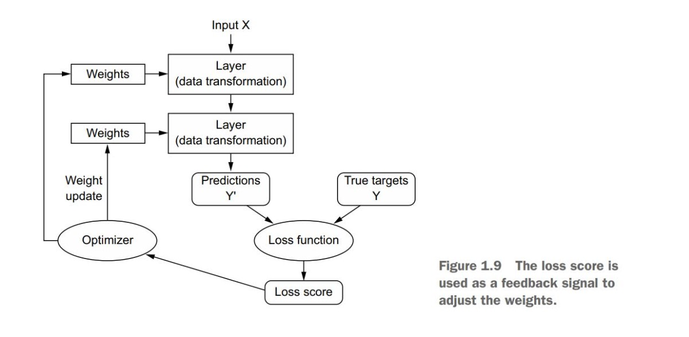

## Terminologies

- Symbolic AI:  In fact, for a fairly long time, most experts believed that human-level artificial intelligence could be achieved by having programmers handcraft a sufficiently large set of explicit rules for manipulating knowledge stored in explicit databases. This approach is known as symbolic AI. It was the dominant paradigm in AI from the 1950s to the late 1980s, and it reached its peak popularity during the expert systems boom of the 1980s.

- lthough symbolic AI proved suitable to solve well-defined, logical problems, such as playing chess, it turned out to be intractable to figure out explicit rules for solving more complex, fuzzy problems, such as image classification, speech recognition, or natural language translation. A new approach arose to take symbolic AI’s place: machine learning

- Machine learning turns this around: the machine looks at the input data and the corresponding answers, and figures out what the rules should be. A machine learning system is trained rather than explicitly programmed. It’s presented with many examples relevant to a task, and it finds statistical structure in these examples that eventually allows the system to come up with rules for automating the task.

- You can think of a deep network as a multistage information distillation process, where information goes through successive filters and comes out increasinglypurified (that is, useful with regard to some task).

- The specification of what a layer does to its input data is stored in the layer’s weights, which in essence are a bunch of numbers. In technical terms, we’d say that the transformation implemented by a layer is parameterized by its weights 
(Weights are also sometimes called the parametersof a layer.) In this context, learning means finding a set of values for the weights of all layers in a network, such that the network will correctly map example inputs to their associated targets.

