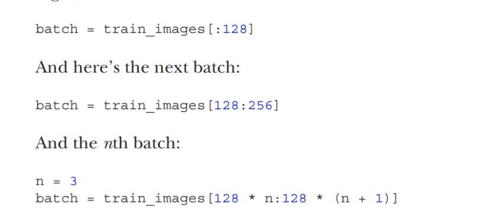
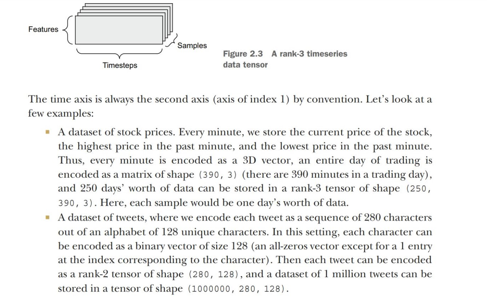
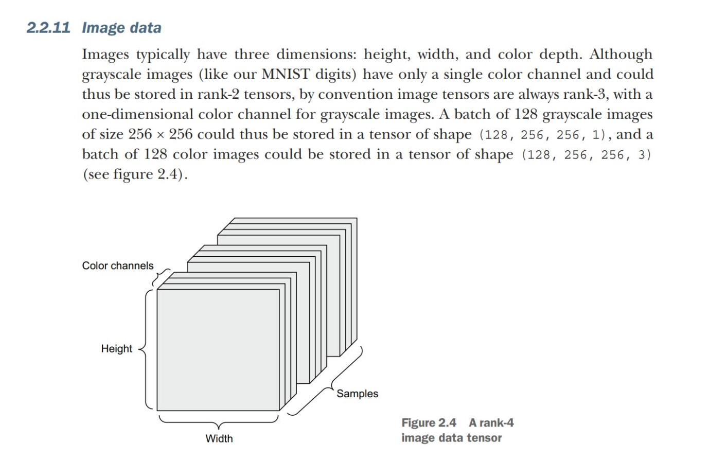
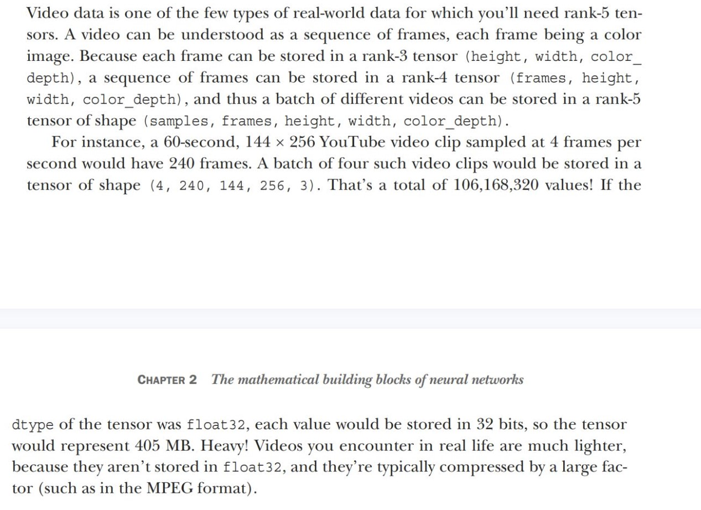

# Data Representation for Neural Networks

## The notion of data batches
In general, the first axis (axis 0, because indexing starts at 0) in all data tensors you’ll come across in deep learning will be the samples axis (sometimes called the samples dimension). In the MNIST example, “samples” are images of digits.

**Batch dimentions or Batch axis**
In addition, deep learning models don’t process an entire dataset at once; rather, they break the data into small batches. Concretely, here’s one batch of our MNIST digits, with a batch size of 128, When considering such a batch tensor, the first axis (axis 0) is called the batch axis or batch dimension
.
This is a term you’ll frequently encounter when using Keras and other deep learning libraries.

## Real-word example of data tensors

1.  Vector data:
Rank-2 tensors of shape **(samples, features)**, where each sample is a vector of numerical attributes (“features”).

2. Timeseries data or sequence data:
Rank-3 tensors of shape **(samples, timesteps, features)**, where each sample is a sequence (of length timesteps) of feature
vectors. 

3. Images:
Rank-4 tensors of shape **(samples, height,width,channels)**, where each sample is a 2D grid of pixels, and each pixel is represented by a vector of values (“channels”)

4. Video
Rank-5 tensors of shape **(samples,frames,height,width,channels)**, where each sample is a sequence (of lengthframes)of images.

### Vector data
This is one of the most common cases. In such a dataset, each single data point can be encoded as a vector, and thus a batch of data will be encoded as a rank-2 tensor (that is, an array of vectors), where the first axis is the samples axis
and the second axis is the features axis.

Two examples:
1. An actuarial dataset of people, where we consider each person’s age, gender,and income. Each person can be characterized as a vector of 3 values, and thus an entire dataset of 100,000 people can be stored in a rank-2 tensor of shape (100000,3).
2. A dataset of text documents, where we represent each document by the counts of how many times each word appears in it(out of a dictionary of 20,000 common words). Each document can be encoded as a vector of 20,000 values (one count per word in the dictionary), and thus an entire dataset of 500 documents can be stored in a tensor of shape(500,20000).

### Timeseries data or sequence data

Whenever time matters in your data (or the notion of sequence order), it makes sense to store it in a rank-3 tensor with an explicit time axis. Each sample can be encoded as a sequence of vectors (a rank-2 tensor), and thus a batch of data will be encoded as a rank-3 tensor.

### Image data

## Video data

