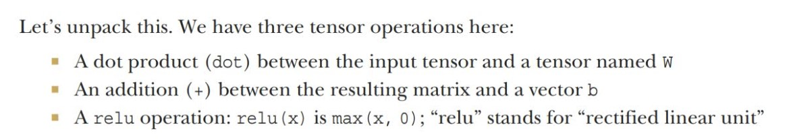
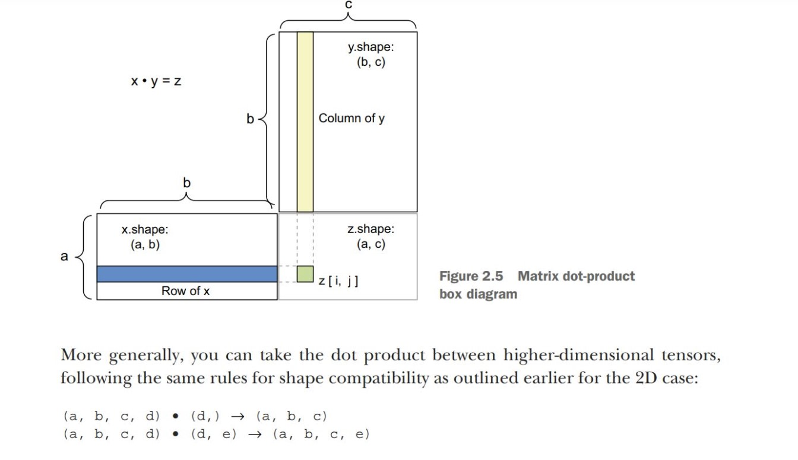

# The gears of neural networks: Tensor operations

## Understand `keras.layers.Dense(512, activation="relu")`

his layer can be interpreted as a function, which takes as input a matrix and returns another matrix—a new representation for the input tensor. Specifically, the function is as follows (where W is a matrix and b is a vector, both attributes of the layer):

`output = relu(dot(input, W) + b)`

## Tensor Production
The tensor product, or dot product (not to be confused with an element-wise product, the * operator), is one of the most common, most useful tensor operations.

- The **dot product** between two vectors is a scalar and that only vectors **with the same number of elements** are compatible for a dot product.

- Note that as soon as one of the two tensors has an ndim greater than 1, dot is no longer symmetric, which is to say that **dot(x,y) isn’t the same as dot(y,x).**

- The most common applications may be the dot product between two matrices. You can take the dot product of two matrices
x and y (dot(x,y)) if and only if x.shape[1] == y.shape[0].  The result is a matrix with shape (x.shape[0],y.shape[1])

