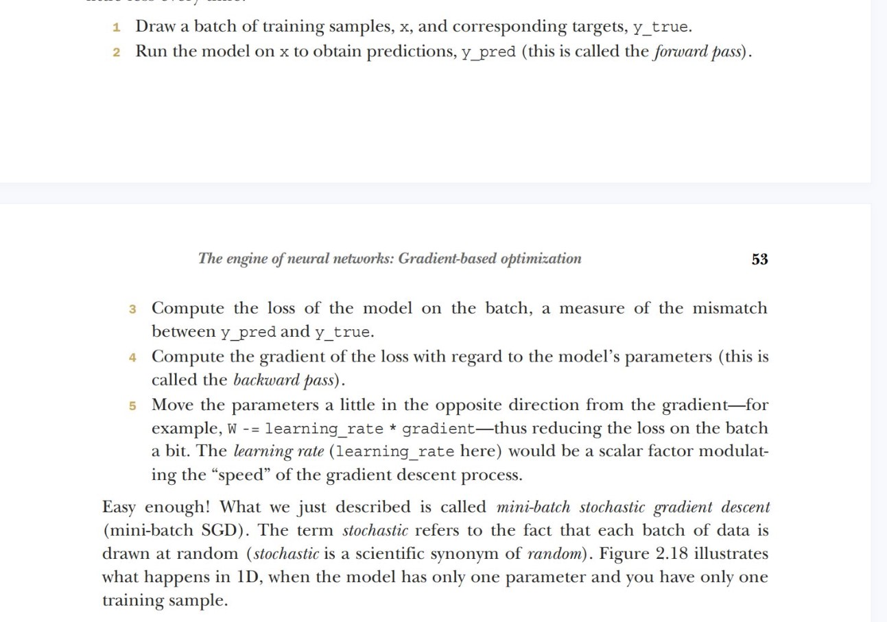
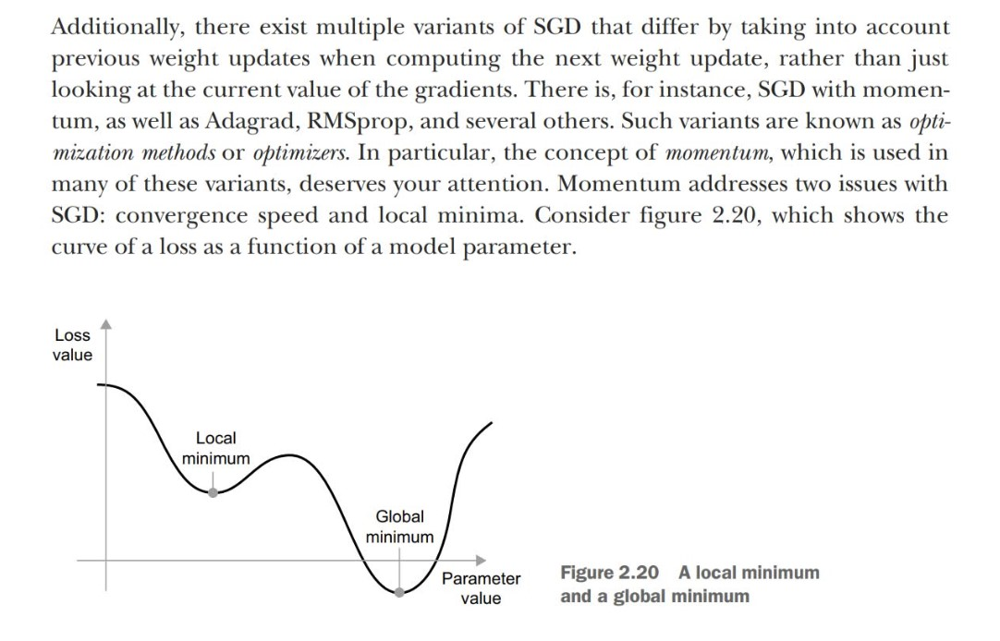
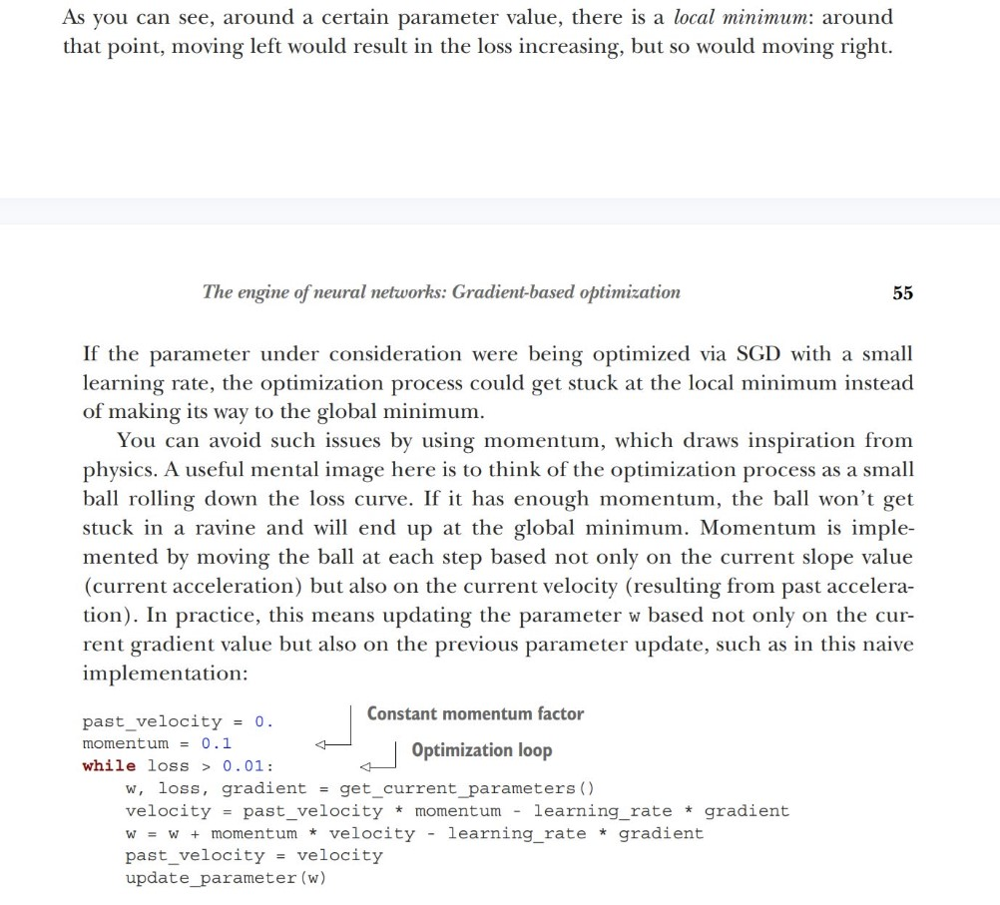

# The engine of neural networks: Gradient-based optimization

Initially, these weight matrices are filled with small random values (a step called random initialization).
Of course, there’s no reason to expect that relu(dot(input,W)+b), when W and b are random, will yield any useful representations. The resulting representations are meaningless—but they’re a starting point. What comes next is to
gradually adjust these weights, based on a feedback signal. This gradual adjustment, also called
training, is the learning that machine learning is all about.

## Variants of SGD (Stochastic gradient descent)

