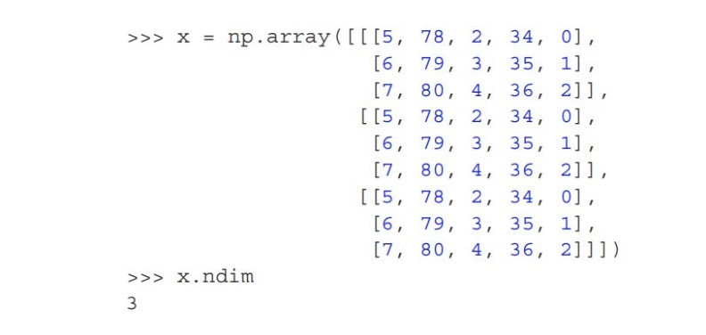

# Data representations for neural networks

In the MNIST example, we started from data stored in multidimensional NumPy arrays, also called
tensors. In general, all current machine learning systems use tensors as their basic data structure. Tensors are fundamental to the field—so fundamental that TensorFlow was named after them. So what’s a tensor?

At its core, a tensor is a container for data—usually numerical data. So, it’s a container for numbers. You may be already familiar with matrices, which are rank-2 tensors: tensors are a generalization of matrices to an arbitrary number of
dimensions(note that in the context of tensors, a dimension is often called an axis)


## Scalars (rank-0 tensors)
A tensor that contains only one number is called a scalar (or scalar tensor, or rank-0 tensor, or 0D tensor). In NumPy, a float32 or float64 number is a scalar tensor (or scalar array).


## Vectors (rank-1 tensors)
An array of numbers is called a vector, or rank-1 tensor, or 1D tensor. A rank-1 tensor is said to have exactly one axis.
````python
x = np.array([
12, 3, 6, 14, 7])

x.ndim=1
````

This vector has five entries and so is called a 5-dimensional vector. Don’t confuse a 5D vector with a 5D tensor!
5D vector has only one axis and has five dimensions along its axis, whereas a 5D tensor has five axes (and may have any number of dimensions along each axis.

Dimensionality can denote either the number of entries along a specific axis (as in the case of our 5D vector) or the number of axes in a tensor (such as a 5D tensor), which can be confusing at times. In the latter case, it’s technically more
tensor of rank 5 (the rank of a tensor being the number of axes), but the ambiguous notation 5D tensor is common regardless.

## Matrices (rank-2 tensors)

An array of vectors is a matrix, or rank-2 tensor, or 2D tensor. A matrix has two axes
(often referred to as rows and columns).

````python

x = np.array([[5, 78, 2, 34, 0],
              [6, 79, 3, 35, 1],
              [7, 80, 4, 36, 2]])
````
The entries from the first axis are called the rows, and the entries from the second axis are called the columns
. In the previous example, [5,78,2,34,0] is the first row of x, and [5,6,7] is the first column.

## Rank-3 and higher-rank



By packing rank-3 tensors in an array, you can create a rank-4 tensor, and so on. In deep learning, you’ll generally manipulate tensors with ranks 0 to 4, although you may go up to 5 if you process video data.


# Attributes of Tensors

Three key attributs:
1. Number of axes (rank):
For instance, a rank-3 tensor has three axes, and a matrix has two axes. This is also called the tensor’s ndim in Python libraries such as NumPy or TensorFlow.
2. Shape
This is a tuple of integers that describes how many dimensions the tensor has along each axis. For instance, the previous matrix example has shape(3,5), and the rank-3 tensor example has shape (3,3,5).
A vector has a shape with a single element, such as (5,), whereas a scalar has an empty shape,().
3. Data type (usually called dtype in Python libraries) 
- This is the type of the data contained in the tensor; for instance, a tensor’s type could be float16, float32, float64,
uint8, and so on. In TensorFlow, you are also likely to come across string tensors.

# Manipulate tensors in NumPy

The following example selects digits #10 to #100 (#100 isn’t included) and puts them in an array of shape (90, 28, 28):

````python
my_slice = train_images[10:100] == train_images[10:100, :, :] ==train_images[10:100,0:28, 0:28]

````
In general, you may select slices between any two indices along each tensor axis. For instance, in order to select 14 × 14 pixels in the bottom-right corner of all images, you would do this:
````
my_slice = train_images[:, 14 :, 14:]

````

It’s also possible to use negative indices. Much like negative indices in Python lists, they indicate a position relative to the end of the current axis. In order to crop the images to patches of 14 × 14 pixels centered in the middle, you’d do this:

````
my_slice = train_images[:, 7:-7, 7:-7]
````
