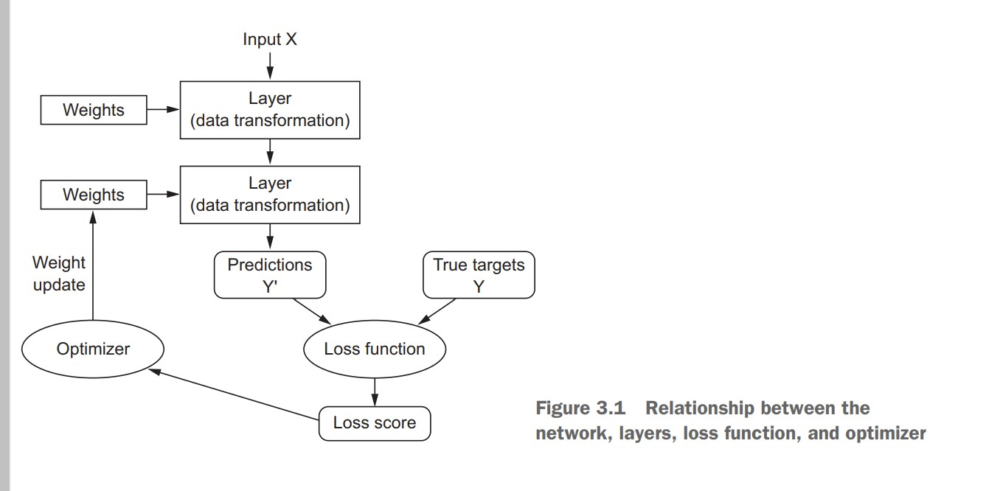
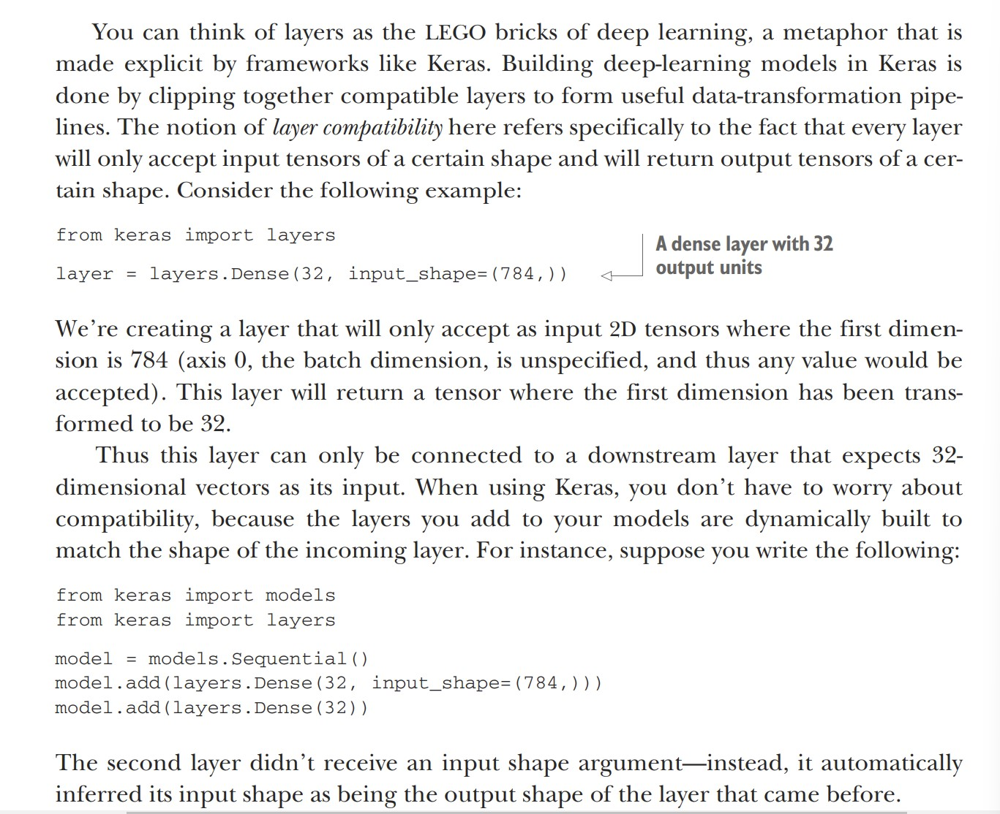
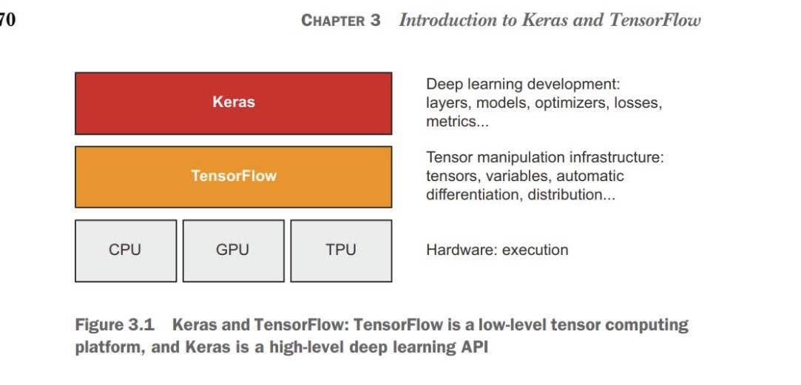

# Anatomy of a neural network

As you saw in the previous chapters, training a neural network revolves around the following objects:
- Layers, The fundamental data structure in neural networks is the layer
- The input data and corresponding targets
- The loss function, which defines the feedback signal used for learning
- The optimizer, which determines how learning proceeds and uses loss vlaue to update the networks weights

### 1. Layers: the building block of deep learning

Different layers are appropriate for different tensor formats and different types of data processing.  
- simple vector data, stored in rank-2 tensors of shape (samples, features), is often processed by densely connected layers, also called fully connected or dense layers **(the Dense class in Keras)**. 
- Sequence data, stored in rank-3 tensors of shape (samples, timesteps, features), is typically processed by recurrent layers such as an **LSTM layer** or  **1D convolution layers (Conv1D)**
- Image data, stored in rank-4 tensors, is usually processed by 2D convolution layers **(Conv2D)**
You can think of layers as the LEGO bricks of deep learning, a metaphor that is made explicit by Keras. Building deep learning models in Keras is done by clipping together compatible layers to form useful data-transformation pipelines.

- 
Layer is an object that encapsulates some state (weights) and some computation (a forward pass). The weights are typically defined in a build() (although they could also be created in the constructor, __init__()), and the computation is defined in
the call() method.

### 2. Models: networks of layers
A deep-learning model is a directed, acyclic graph of layers. The most common instance is a linear stack of layers, mapping a single input to a single output.
But as you move forward, you’ll be exposed to a much broader variety of network topologies. Some common ones include the following:
- Two-branch networks
- Multihead networks
- Inception blocks

### 3. Loss functions and optimizers: Keys to configuring the learning process
Once the network architecture is defined, you still have to choose two more things:
- Loss function (objective function)—The quantity that will be minimized during training. It represents a measure of success for the task at hand.
- Optimizer—Determines how the network will be updated based on the loss function. It implements a specific variant of stochastic gradient descent (SGD).

A neural network that has multiple outputs may have multiple loss functions (one per output). But the gradient-descent process must be based on a single scalar loss value; so, for multiloss networks, all losses are combined (via averaging) into a single scalar quantity.

Fortunately, when it comes to common problems such as classification, regression, and sequence prediction, there are simple guidelines you can follow to choose the correct loss. 
-  binary crossentropy for a two-class classification problem
- categorical crossentropy for a many-class classification problem
- meansquared error for a regression problem
- connectionist temporal classification (CTC) for a sequence-learning problem, and so on. 
Only when you’re working on truly new research problems will you have to develop your own objective functions.

## Introducing to Keras and Tensorflow

### Setting up deep learning workspace

- It’s highly recommended, although not strictly necessary, that you run deep learning code on a modern NVIDIA GPU rather than your computer’s CPU.

- How to access GPU?

    - Buy and install a physical NVIDIA GPU on your workstation.
    - Use GPU instances on Google Cloud or AWS EC2.
    - Use the free GPU runtime from Colaboratory, a hosted notebook service offered by Google.

- Other setups
    - dditionally, whether you’re running locally or in the cloud, it’s better to be using a Unix workstation.
    - Although it’s technically possible to run Keras on Windows directly, we don’t recommend it. If you’re a Windows user and you want to do deep learning on your own workstation, the simplest solution to get everything running is to set up an Ubuntu dual boot on your machine, or to leverage Windows Subsystem for Linux (WSL), a compatibility layer that enables you to run Linux applications from Windows. It may seem like a hassle, but it will save you a lot of time and trouble in the long run.

- Colab, go to https//colab.research.google.com
    - run a cell: shift+enter

- Packages
    - The default Colab environment already comes with TensorFlow and Keras installed, so you can start using it right away without any installation steps required. But if you ever need to install something with ``pip``, you can do so by using the following syntax in a code cell (note that the line starts with ! to indicate that it is a shell command rather than Python code):
    ``!pip install package_name``

