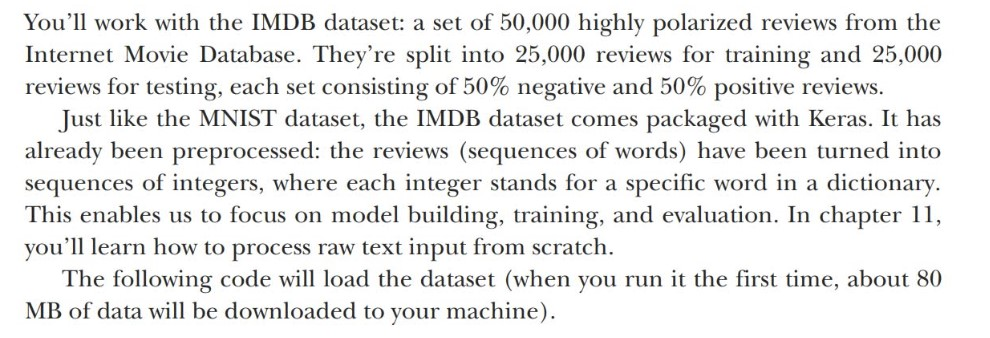
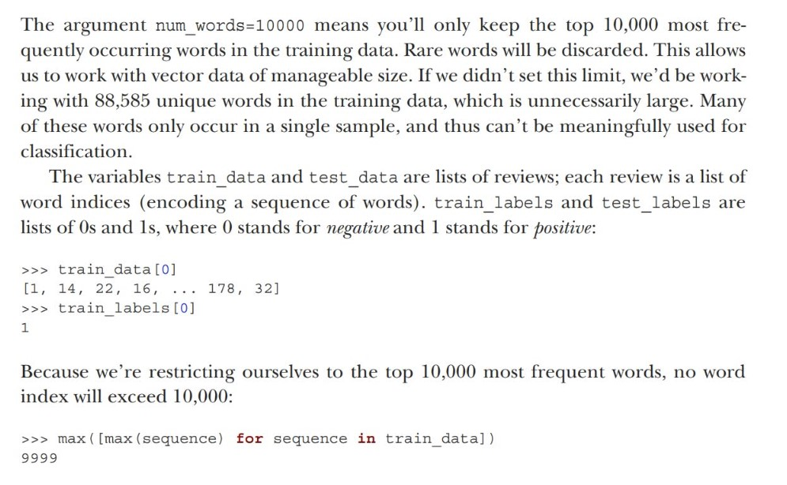
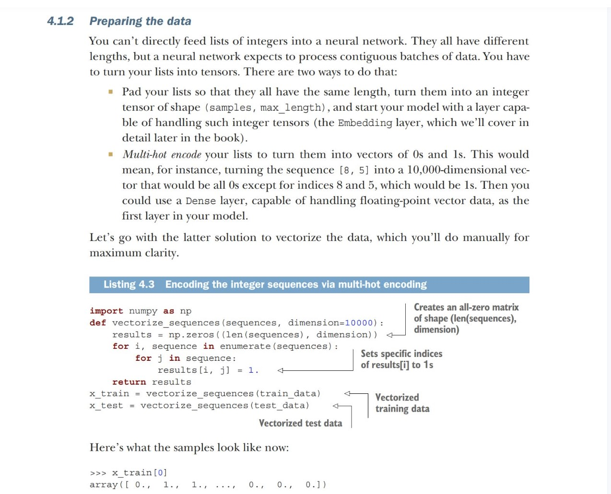
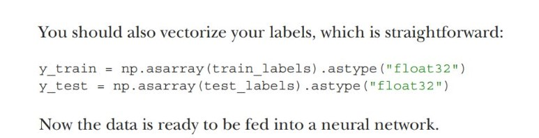
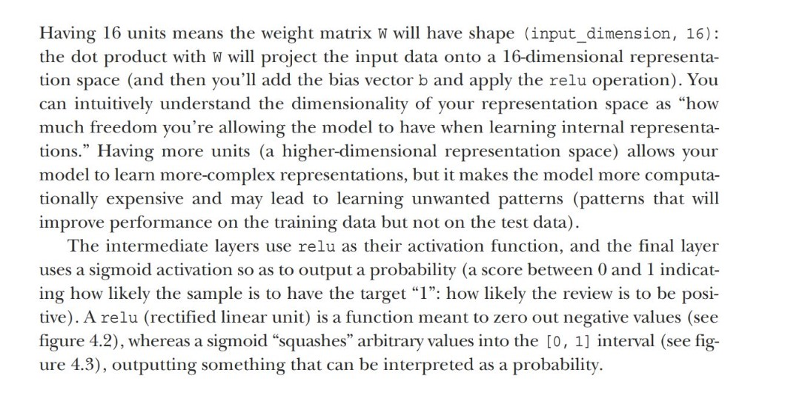
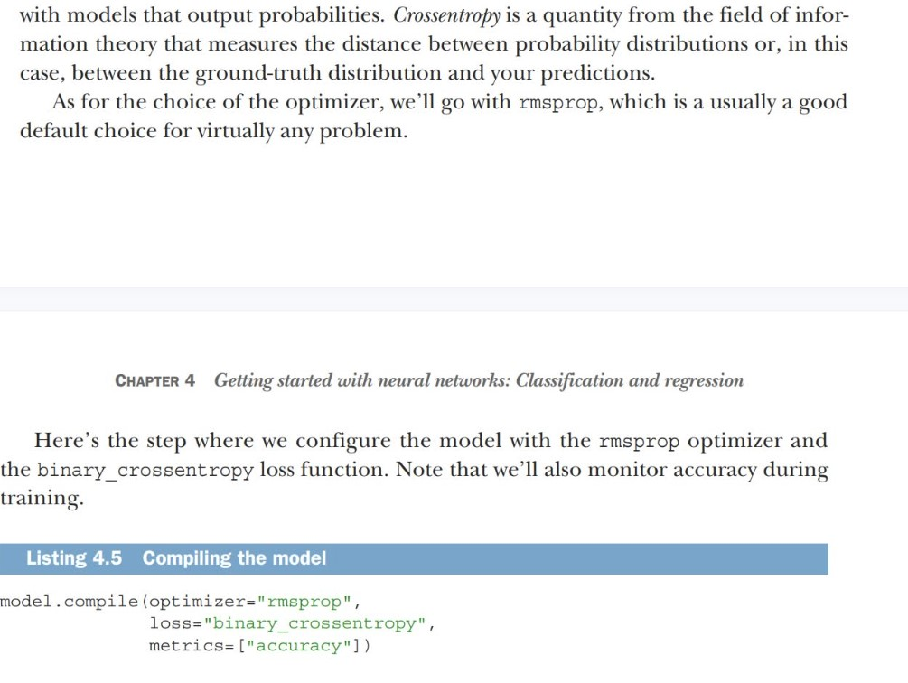
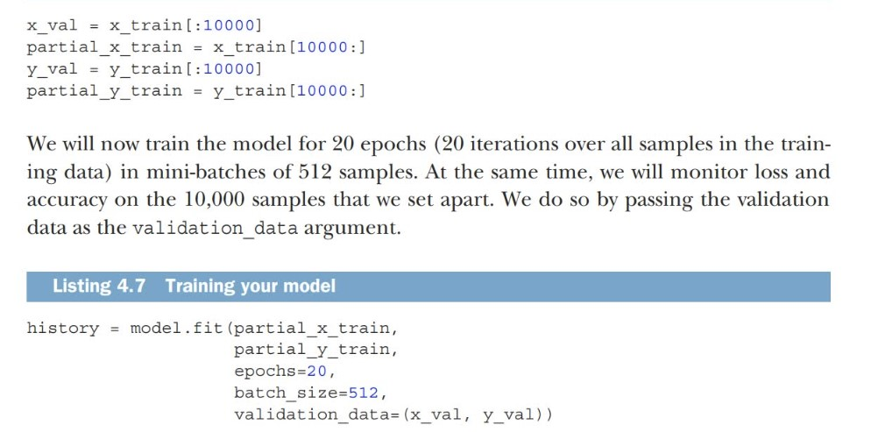
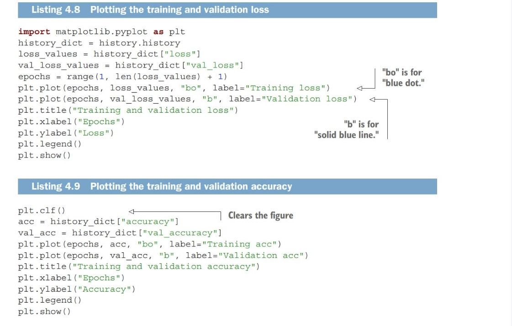
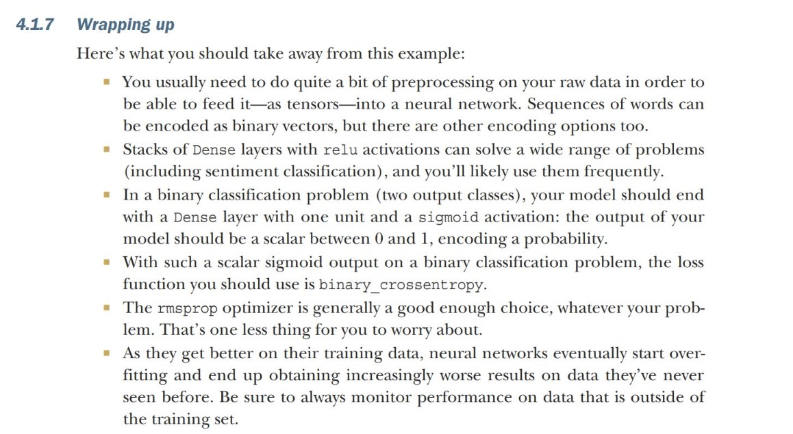

# Classifying movie reviews, A Binary Classification

Learn how to classify moview reviews as positive or negative, based on the text content of the reviews


## IMDB datasets




### Loading the IMDB datasets

````python
from tensorflow.keras.datasets import imdb
(train_data, train_label),(test_data, test_label)=imdb.load_data(num_words=10000)


````
explaination about the datasets:




### Decode the reviews back to english


### Prepare the data





### Build your model
The inputs data is vectors and the labels are scalars (1s and 0s). A type of model that performs well on such a problem is a plain stack of densely connected ***(Dense)*** layers with **relu** activations.

2 Key architecture decisons to be made about such a stack of Dense layers:

- How many layers to use
- How many units to choose for each layer

````python

from tensorflow import keras
from tensorflow.keras import layers

model= keras.Sequential([
    layers.Dense(16, activation='relu'),
    layers.Dense(16, activation='relu'),
    layers.Dense(1, activation='sigmoid')
])

````

The first argument being passed to each ***Dense*** layer is the number of *units* in the layer: the dimentionality of representation space of the layer.



### Choose optimizers and loss function




### Validate your approach





## Wrap up




