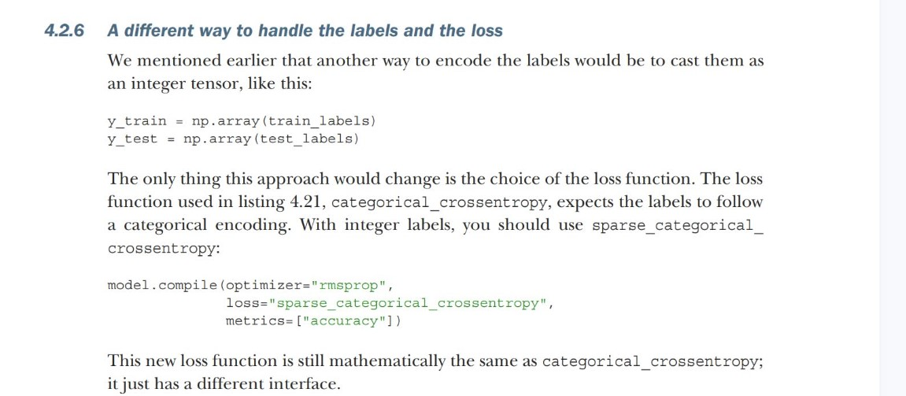
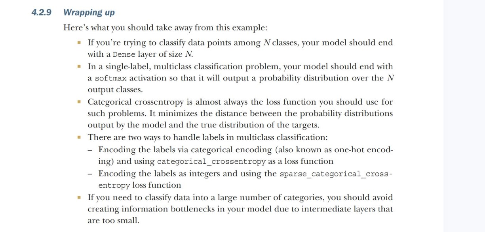

# Classifying newswires: A multiclass classification example

In this section, we’ll build a model to classify Reuters newswires into 46 mutually exclusive topics. Because we have many classes, this problem is an instance of multiclass classification, and because each data point should be classified into only one category, the problem is more specifically an instance of single-label multiclass classification.
If each data point could belong to multiple categories (in this case, topics), we’d be facing a multilabel multiclass classification problem.


## The Reuters dataset

You’ll work with the Reuters dataset, a set of short newswires and their topics, published by Reuters in 1986. It’s a simple, widely used toy dataset for text classification. There are 46 different topics; some topics are more represented than others, but each topic
has at least 10 examples in the training set.

````python
from tensorflow.keras.datasets import reuters
(train_data, train_labels), (test_data, test_labels)= reuters.load_data(num_words=10000)
# the argument num_words=10000 restricts the data to the 10,000 most frequently occurring words found in the data.


len(train_data)
len(test_data)
train_data[10]


# The label associated with an example is an integer between 0 and 45—a topic index:
train_label[10]
````

## Prepare the data

````python
x_train=vectorize_sequence(train_data)
x_test=vectorize_sequence(test_data)


# one hot encoding for labels

def to_one_hot(labels, dimension=46):
    results=np.zeros(len(labels), dimension)
    for i, label in enumerate(labels):
        results[i, label]=1
    return results

y_train=to_one_hot(train_labels)
y_test=to_one_hot(test_labels)


#Note that there is a built-in way to do this in keras


from tensorflow.keras.utils import to_categorical
y_train=to_categorical(train_labels)
y_test=to_categorical(test_labels)

````


## Building your model
This topic-classification problem looks similar to the previous movie-review classification problem: in both cases, we’re trying to classify short snippets of text. But there is a new constraint here: the number of output classes has gone from 2 to 46. The dimensionality of the output space is much larger.

````python
model = keras.Sequential([
    layers.Dense(64, activation="relu"),
    layers.Dense(64, activation="relu"),
    layers.Dense(46, activation="softmax")
])
````

There are two other things you should note about this architecture.
- First, we end the model with a Dense layer of size 46. This means for each input sample, the network will output a 46-dimensional vector. Each entry in this vector (each dimension) will encode a different output class.
- Second, the last layer uses a softmax activation. You saw this pattern in the MNIST example. It means the model will output a
probability distribution over the 46 different output classes—for every input sample, the model will produce a 46-dimensional output vector, where output[i] is the probability that the sample belongs to class i. The 46 scores will sum to 1.

````python
model.compile(optimizer="rmsprop", loss="categorical_crossentropy", metrics=["accuracy"])

````

## Validate the approach

````python

history=model.fit(x_train[:10000], y_train[:10000], batch_size=512, epochs=20, validation_data=(x_train[10000:], y_train[10000:]) )

````

## Ploting the loss and accuray on matplotlib

see the Binary classification note book

## Generating predications on new data

````python
predictions=model.predict(x_test)

predictions[0].shape

# The coefficients in this vector sum to 1, as they form a probability distribution:
np.sum(predictions[0])

# The largest entry is the predicted class—the class with the highest probability:
np.argmax(predictions[0])

````


## A different way to handle the labels and the loss



## The importance of having sufficiently large intemdiate layers


## Wrapping up



