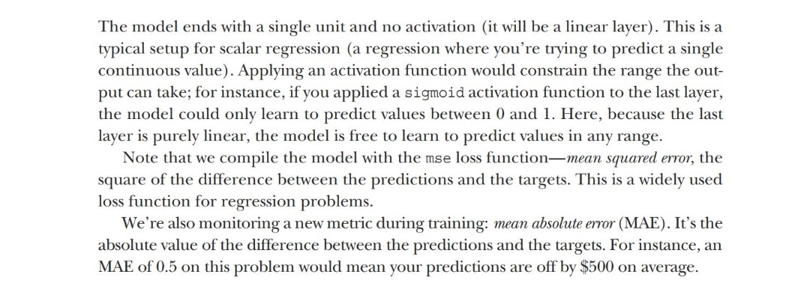
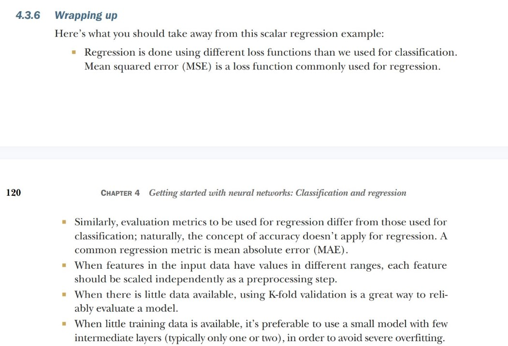

# Predicting house prices: A regression example

## Loading the boston housing datasets

````python
from tensorflow.keras.datasets import boston_housing
(train_data, train_targets),(test_data, test_targets) = (boston_housing.load_data())

train_data.shape

test_data.shape

train_targets

````
As you can see, we have 404 training samples and 102 test samples, each with 13 numerical features, such as per capita crime rate, average number of rooms per dwelling, accessibility to highways, and so on.
The targets are the median values of owner-occupied homes, in thousands of dollars.

## Prepare the data

It would be problematic to feed into a neural network values that all take wildly different ranges. The model might be able to automatically adapt to such heterogeneous data, but it would definitely make learning more difficult. A widespread best practice
for dealing with such data is to do feature-wise normalization: for each feature in the input data (a column in the input data matrix), we subtract the mean of the feature and divide by the standard deviation, so that the feature is centered around 0 and has
a unit standard deviation. This is easily done in NumPy.

````python
mean=train_data.mean(axis=0)
train_data -=mean

stf=train_data.std(axis=0)
train_data /=std

test_data -=mean
test_data /=std

````

**Note that the quantities used for normalizing the test data are computed using the training data. You should never use any quantity computed on the test data in your workflow, even for something as simple as data normalization.**

## Building the model

````python
def build_model():
    model = keras.Sequential([
        layers.Dense(64, activation="relu"),
        layers.Dense(64, activation="relu"),
        layers.Dense(1)])
    model.compile(optimizer="rmsprop", loss="mse", metrics=["mae"])
    return model
````




## Validate your approach using K-fold validation

To evaluate our model while we keep adjusting its parameters (such as the number of epochs used for training), we could split the data into a training set and a validation set, as we did in the previous examples. But because we have so few data points, the
validation set would end up being very small (for instance, about 100 examples). As a consequence, the validation scores might change a lot depending on which data points we chose for validation and which we chose for training: the validation scores might have a high
variance with regard to the validation split. This would prevent us from reliably evaluating our model.

 on our binary classification model, we retrieved a scalar score between 0 and 1 for each input sample. With our multiclass classification model, we retrieved a probability distribution over all classes for each sample. Now, with this scalar regression model, predict() returns the model’s guess for the sample’s price in thousands of dollars:

````python

predictions = model.predict(test_data)
predictions[0]
array([9.990133],dtype=float32)
#The first house in the test set is predicted to have a price of about $10,000.


````


## Wrapping up



