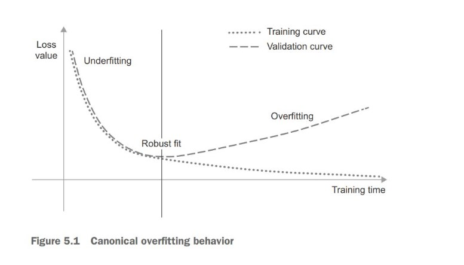
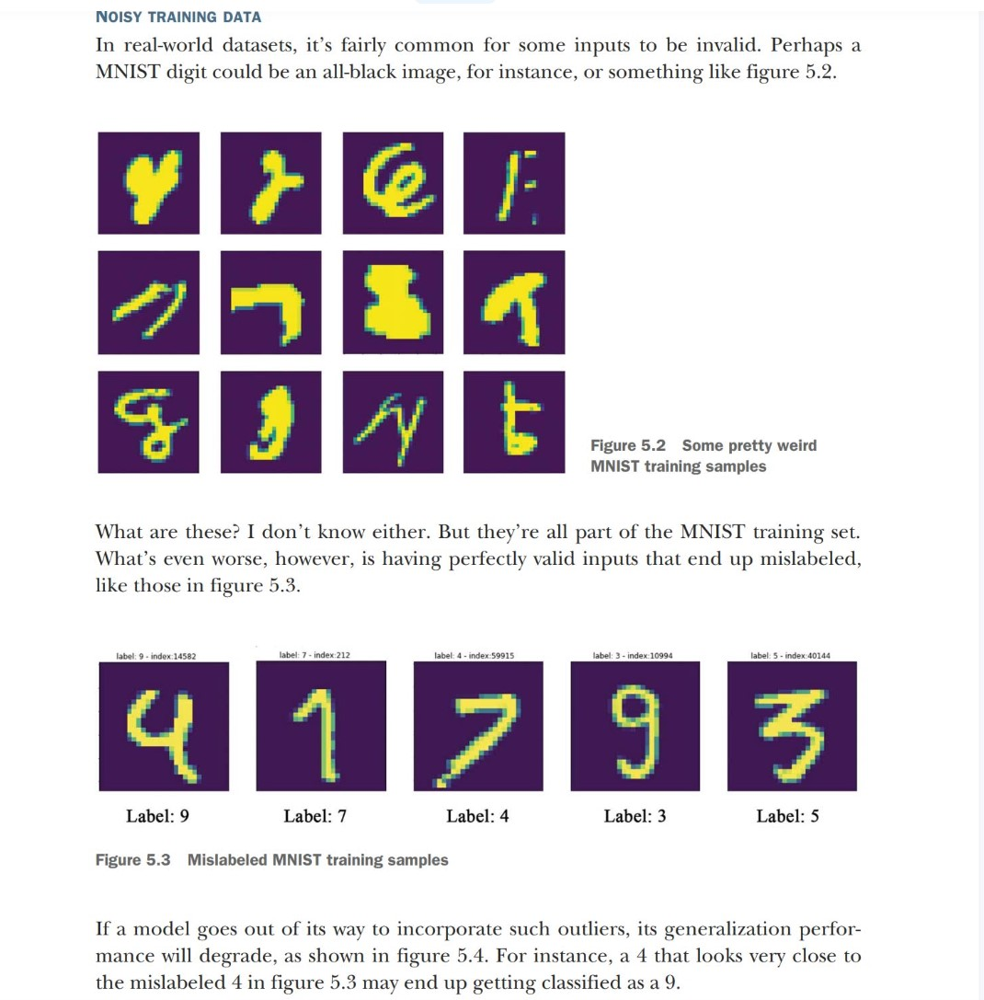
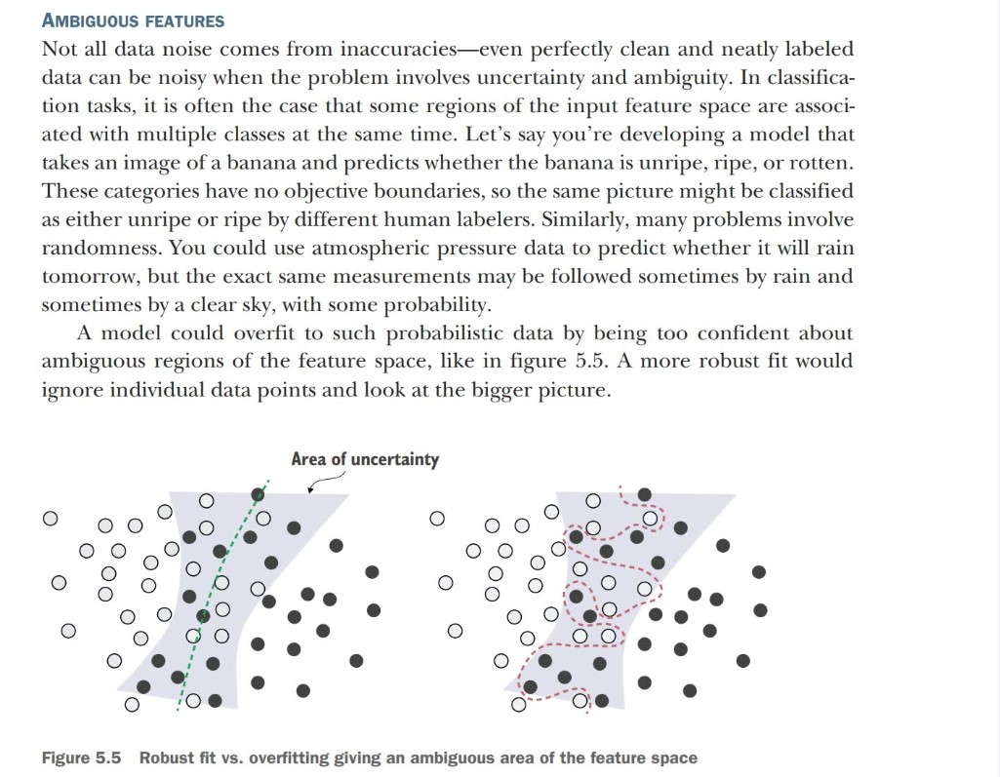
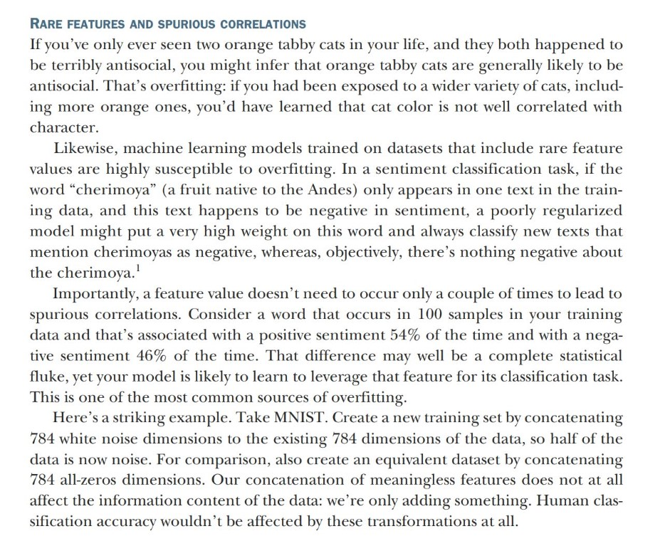

# Generalization: The goal of machine learning

The fundamental issue in machine learning is the tension between optimization and generalization. Optimization refers to the process of adjusting a model to get the best performance possible on the training data (the learning in machine learning),whereas generalization refers to how well the trained model performs on data it has never seen before. The goal of the game is to get good generalization, of course, but you don’t control generalization; you can only fit the model to its training data. If you do that
too well, overfitting kicks in and generalization suffers.

## Overfitting is universal

**Overfitting is particularly likely to occur when your data is noisy, if it involves uncertainty, or if it includes rare features.**

### Noisy Training data

### Ambiguous features

### Rare features and spurious correlations

